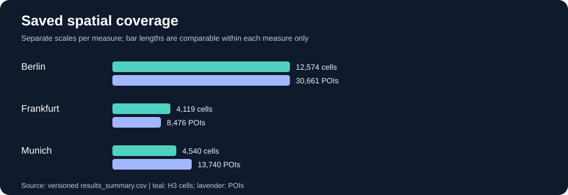

# Geospatial Market Potential & Site Selection Analytics

**Oliver Wyman × STADS Data & Analytics Hackathon 2026 · Team project · Independently maintained portfolio edition**

[**Explore the live dashboard**](https://olive-site-selection.streamlit.app/) · [**Review measured outputs**](RESULTS.md) · [**Reproduce the setup**](SETUP.md) · [**Portfolio landing page**](https://kathachn.github.io/ow_hackathon_group1/) · [**Original team repository**](https://github.com/annaantoniya/ow_hackathon_group1)

> **Research prototype, not a commercial site recommendation.** This portfolio edition preserves the original collaborative provenance while providing an independently hosted application, versioned analytical outputs and reproducibility checks.

## The problem

Where might an urban premium-grocery concept find attractive expansion opportunities? The project combines demographic information, neighbourhood amenities and competing retail locations to explore **Berlin, Frankfurt and Munich** at H3 hexagon resolution 9.

## At a glance

| Coverage | Value |
|---|---:|
| Cities analysed | 3 |
| H3 cells with saved scores | 21,233 |
| OSM points of interest in saved inputs | 52,877 |
| Candidate cells selected per city | 5 |

See [**RESULTS.md**](RESULTS.md) for city-level counts, PCA diagnostics, the stored regression comparison, and interpretation limits. These values describe saved artifacts, not a newly reproduced model run.

## Saved analytical results

The figures below are extracted from the **versioned output files**. They are not estimates generated for this README.

| City | Scored H3 cells | Recorded OSM POIs | Portfolio sites | POI share in top-ranked cells¹ | PCA PC1 variance explained |
|---|---:|---:|---:|---:|---:|
| Berlin | 12,574 | 30,661 | 5 | 83.6% | 81.4% |
| Frankfurt | 4,119 | 8,476 | 5 | 81.7% | 75.4% |
| Munich | 4,540 | 13,740 | 5 | 68.3% | 79.8% |



**Stored regression comparison (out-of-sample explained deviance as reported in the saved model artifact):** Poisson **47.43%**, negative binomial **51.30%**, spatial negative binomial **51.20%**. The saved report selects the negative-binomial specification. The spatial model's parameter selection on the same cross-validation makes its comparison somewhat optimistic; spatial dependence also affects uncertainty estimates.

¹ The POI share is an **internal plausibility statistic**, not a validated prediction of store performance. PCA explained variance is a diagnostic, not forecasting accuracy. These metrics must not be interpreted as investment returns or causal effects.

**[Detailed results and methodological caveats](RESULTS.md)** · **[Interactive results overview](https://kathachn.github.io/ow_hackathon_group1/)** · **[Live Streamlit dashboard](https://olive-site-selection.streamlit.app/)**

## Analytical approach

1. **Geospatial data engineering:** Integrate Zensus 2022 grid indicators and OpenStreetMap points of interest.
2. **Spatial aggregation:** Align features with H3 resolution-9 hexagons.
3. **Location scoring:** Explore demand-related features, neighbourhood accessibility and competition, including distance-sensitive / Huff-inspired components.
4. **Statistical modelling:** Compare count-regression variants and inspect PCA diagnostics and model assumptions.
5. **Decision support:** Evaluate candidate location portfolios and compare scenarios in an interactive Streamlit dashboard.

Detailed project specifications are preserved in [`Specs/`](Specs/); actual code and saved outputs should be treated as authoritative for the implemented revision.

## Repository guide

| Path | Contents |
|---|---|
| `app.py`, `konzept.py`, `vergleich.py`, `methodik.py` | Streamlit application and presentation modules |
| `datengrundlage.py` | Input-data preparation |
| `analyse.py` | Analytical calculations and output generation |
| `data/` | Versioned inputs, scores, selected sites and model reports |
| `RESULTS.md`, `results_summary.csv` | Auditable summary of stored outputs |
| `scripts/validate_data.py`, `tests/` | Structural checks on the published data |
| `.github/workflows/quality.yml` | Automated syntax and structural checks on GitHub |
| `SETUP.md` | Local installation and operational guidance |

## Quick start

```bash
python3 -m venv .venv
source .venv/bin/activate
python -m pip install -r requirements.txt
python scripts/validate_data.py
python -m streamlit run app.py
```

See [SETUP.md](SETUP.md) for validation, platform notes and synthetic demo behaviour.

## Interpretation and limitations

- The saved POI concentration statistic is an **internal plausibility check**, not proof of commercial forecast accuracy.
- Stored out-of-sample model metrics reflect the original modelling and validation design; spatial dependence and hyperparameter-selection bias are acknowledged in the saved model report.
- Precomputed artifacts may not exactly reproduce under changed inputs, external services or package versions.
- Synthetic fallback data must not be confused with the saved empirical analysis.
- Data provenance, source attribution and reuse obligations are described in [`data/README.md`](data/README.md).

## Credits and ownership

Developed collaboratively during the **Oliver Wyman × STADS Data & Analytics Hackathon 2026**. The original team repository is maintained at [annaantoniya/ow_hackathon_group1](https://github.com/annaantoniya/ow_hackathon_group1). This is a **forked portfolio edition**, not a claim of sole authorship of the original application or analysis.

**Portfolio edition maintained by Katharina Luran Chen.** This edition adds project-level documentation, consolidated results, structural data checks and a GitHub Actions quality workflow. Individual hackathon contributions should be described separately only when independently verifiable.
